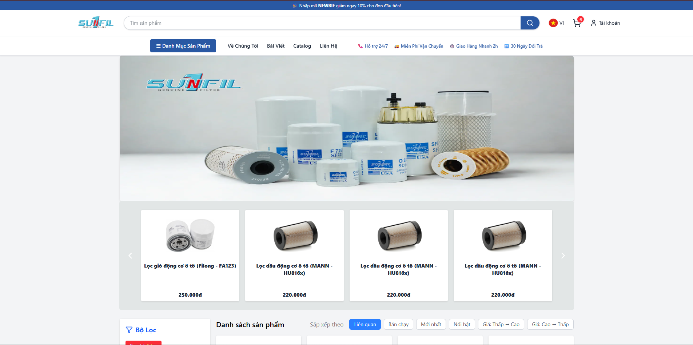
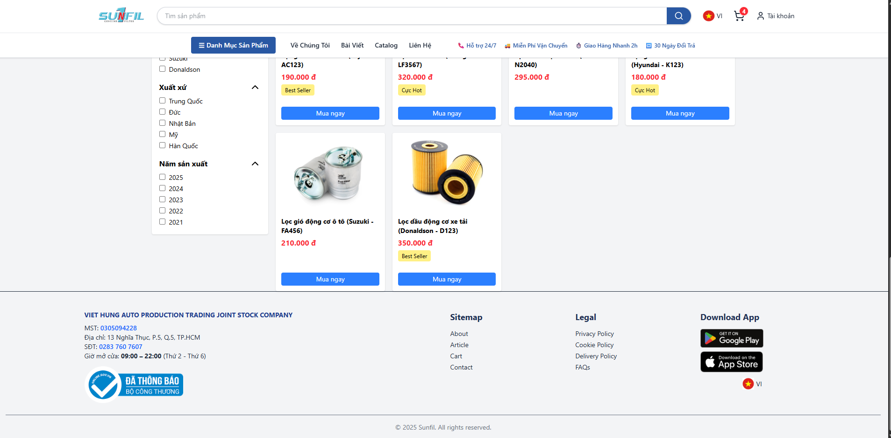

# 🛒 Simple E-commerce Website

Một dự án web bán hàng đơn giản được xây dựng bằng **React** nhằm mô phỏng các tính năng cơ bản như:

- Hiển thị danh sách sản phẩm
- Thêm sản phẩm vào giỏ hàng
- Tăng/giảm số lượng sản phẩm trong giỏ
- Hiệu ứng hover/click để xem giỏ hàng
- Tính tổng số lượng và tổng giá trị đơn hàng

---

---

## 🛠️ Công nghệ sử dụng

- ⚛️ ReactJS + Vite
- 🧠 Context API (quản lý trạng thái giỏ hàng)
- 🧪 Mock data (sản phẩm)
- 🎨 Tailwind CSS (giao diện)
- 🛍️ Lucide Icons (biểu tượng giỏ hàng)

---

## 📁 Cấu trúc thư mục
├── components/
│ ├── cart/ # Các component liên quan đến giỏ hàng
│ │ └── Cart.jsx
│ ├──filter/ # Các component liên quan đến lọc
│ │ └── FilterPanel.jsx
│ ├──banner/ # Các component liên quan đến banner
│ │ └── BannerCarousel.jsx / # Xử lý hiển thị banner
│ │ └── FeaturesProducts.jsx / # Xử lý các sản phẩm phổ biển
│ ├──Gridcard/ # Các component liên quan đến hiển thị sản phẩm
│ │ └── ProductCard.jsx / # Xử lý các sản phẩm hiển thụ (mua hàng)
│ │ └── SortBar.jsx / # Xử lý sắp xếp các sản phẩm
│ ├──header/ # Các component liên quan header
│ │ └── CategoryMenu.jsx / # Xử lý pop up danh mục sản phẩm
│ │ └── headbar.jsx / # Xử lý header
│ ├──footer/ # Các component liên quan footer
│ │ └── footerbar.jsx / # Xử lý các hiển thị footer
├── context/
│ └── CartContext.jsx # Quản lý giỏ hàng với Context API
├── data/
│ └── mockCart.js # Dữ liệu đơn hàng mẫu
│ └── mockBanner.js # Dữ liệu banner mẫu
│ └── mockProducts.js # Dữ liệu sản phẩm mẫu
├── hooks/
│ └── useProductFilter.jsx/ #Xử lý lọc sản phẩm quá các điều kiện
├── pages/
│ └── ProductCategoryPage.jsx/ # Trang chủ hiển thị các component
├── utils/
│ └── sortUtils.js/ # Xử lý sort sản phẩm
├── App.jsx # Trang chính
└── main.jsx # Điểm khởi động ứng dụng
